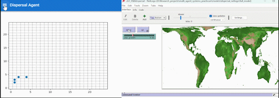

## Practicum 4: Objectives
* Recapping what we have done so far
* Designing and plotting model measurements
* Revisiting and changing other basic models

## Recap
* Anaconda, conda environments, and visual studio code
* Introduction Python Mesa framework
* Basic models: grid model, continuous space model, and network model
* Overview mesa functions (full func model)
* Coding up from scratch: A basic dispersal model

## Python, Anaconda, and visual studio code (IDEs)

## Why python?
* Go-to language for data science and AI tasks
  * We want to ensure that skills are also transferrable to your future courses and career
* Flexible for future projects (reinforcement learning, physics engines, etc.)
* But... steeper learning curve than Netlogo for sure

## Why anaconda
* Creates isolated environments for different projects
* Eliminates "it works on my machine" problems
* Ensures everyone has the same setup
* You learn how to keep things computationally reproducible

## What is an IDE?
* IDE = Integrated Development Environment
* A specialized workspace that combines multiple tools in one place:
  * Code editor (with syntax highlighting and auto-completion)
  * Way to run and test your code
  * Many other things (e.g., version control, debugging tools, etc.)

## Visual Studio as IDE
* Free and cross-platform
* One of the most popular IDEs in industry and academia
* Jupyter notebook/Jupyter fails on python `mesa`'s `solara` visualization 
  * This is because (things like Solara, Dash, Streamlit) need their own local server to run on

## Setting up anaconda, visual studio code, and mesa (practicum 1)
* Installation section on the landing page
  * [install section landing page](https://wimpouw.github.io/multi_agent_systems_practicum/#installation)
* Here is a video that runs the through the basics:
  * [link to instruction video](https://wimpouw.com/videos/introsettinguppythonmesa.mp4)
* If you still have problems come by, and if we cannot fix it during the practical, you can also come by my office at my next troubleshoot slot: 10th of October, D130, 12:45-14:30.

## Basic python Mesa models (practicum 1)
* Grid space model, Continuous space model, Network model
* Downloadable from the landing page:
  * [basic models landing page](https://wimpouw.github.io/multi_agent_systems_practicum/models/basic_python_models.rar)

* But we have not really tinkered with them yet
  * Difficult to tinker, if you dont understand the components
  * But now you have some understanding!

## Basics Mesa (practicum 2)
* Agent class (`class MyAgent(mesa.CellAgent): ...`)
  * Agent behavior (e.g., `def shout_out(self): ...`)
* Model class (`class MyModel(mesa.Model): ...`)
  * Space (`self.grid = OrthogoalMooreGrid(...)`)
  * Agent creation (`MyAgent.create_agents(...)`)
  * Step (`def step(self): ...`)
* Visualization server (`page = SolaraViz(model, [spaceviz], name="Grid Agent")`)
  * Solara vizualization (`make_space_component`)

## Further functionality Mesa (practicum 2)
* Model class (continued)
  * Data collector (briefly shown in [full func model](https://wimpouw.github.io/multi_agent_systems_practicum/models/fullfunc_grid_python_model/grid/full_func_multiagent_grid.html), `self.datacollector = mesa.DataCollector(...)`)
* Making sliders in Solara
* Data collection after model run
* Running multiple models using Batch runner

## Coding from scratch (practicum 3)
* Inspired by the Netlogo model
  * [Netlogo Dispersal model](https://wimpouw.github.io/multi_agent_systems_practicum/models/dispersal_netlogo.rar)
* Starting simple, you coded up a basic dispersal model
* Last checkpoint solution:
  * [Simple Dispersal Model After Practicum 3](https://wimpouw.github.io/multi_agent_systems_practicum/models/dispersal_python_afterpartII.rar)
{width=80%}

## And now...
::: {.center}
{width=50% fig-align="center"}

*Image from [Freepik](https://www.freepik.com)*
:::

## Lets look at the dispersal model afresh
* Download: [Simple Dispersal Model After Practicum 3](https://wimpouw.github.io/multi_agent_systems_practicum/models/dispersal_python_afterpartII.rar)
* Open in visual studio code, run everything
* Understand the components, and ask questions if you have them

## Practicum 4: Objectives
* ~~Recapping what we have done so far~~
* Designing and plotting model measurements
* Revisiting and changing other basic models
  * Implement a change to the model
  * Design a measure that is relevant to the behavior change

## Tinkering
* Tinker with the code a bit
  * Let agents die after they hatch
    * Use (`self.remove()` function) for dieing behavior
    * Update behaviorname
  * Intialize model to 40 agents

## Designing a measure and collect data
* You have now created a [diffusion model](https://en.wikipedia.org/wiki/Diffusion)
* Lets design a measure the diffusion of the population (e.g., the variance (`np.var()`) in x and y coordinates of agents)
* `positions = [agent.cell.coordinate for agent in model.agents]`
* `x_coords = [pos[0] for pos in positions]`
* implement the measure, by creating a function that you input into the data collector
    * look up  [full func model](https://wimpouw.github.io/multi_agent_systems_practicum/models/fullfunc_grid_python_model/grid/full_func_multiagent_grid.html) model for how to create a measure
* setup model data collector in model class
* Plot it (using `make_plot_component`)

## Do it yourself (basic models)
* Open the continuous and network space model
  * Basic models: [basic models landing page](https://wimpouw.github.io/multi_agent_systems_practicum/models/basic_python_models.rar)
* Tinker with them to change the nature of the simulation
* Design a relevant measure for your change, and collect and plot data
* Plot it (using `make_plot_component`)
* If too difficult, take the current model, and change it, and make a new measurement.

## Do it yourself (basic models)
* Cant think of anything to change and measure?
  * Go to the landing page
    * Look up mesa model examples
    * Check the mesa api for functionalities
      * Continuous space agents, network agents, Agents
    * Look up Netlogo examples

## Practicum 4: Objectives
* Recapping what we have done so far
* Designing and plotting model measurements
* Revisiting and changing other basic models
  * Implement a change to the model
  * Design a measure that is relevant to the behavior change